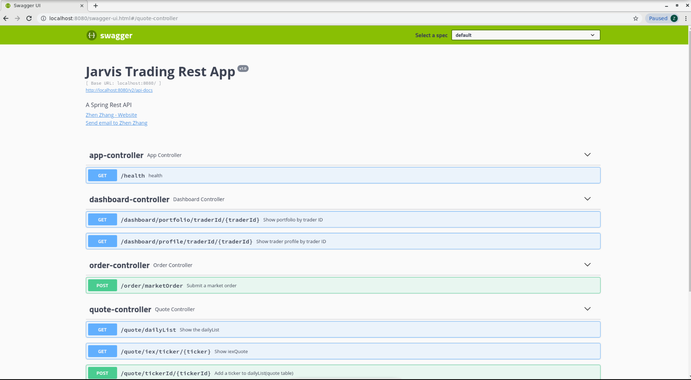
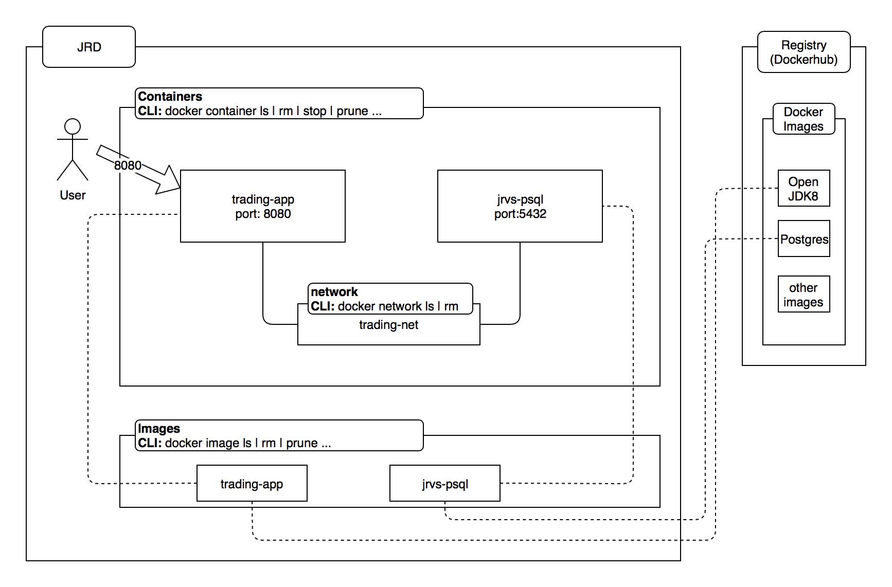
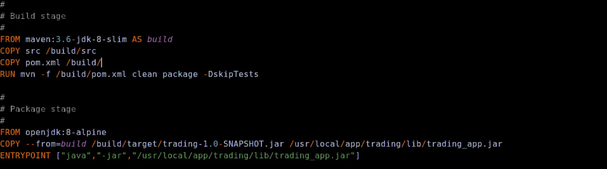
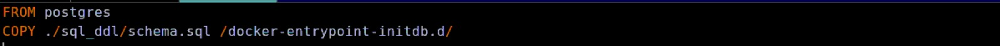
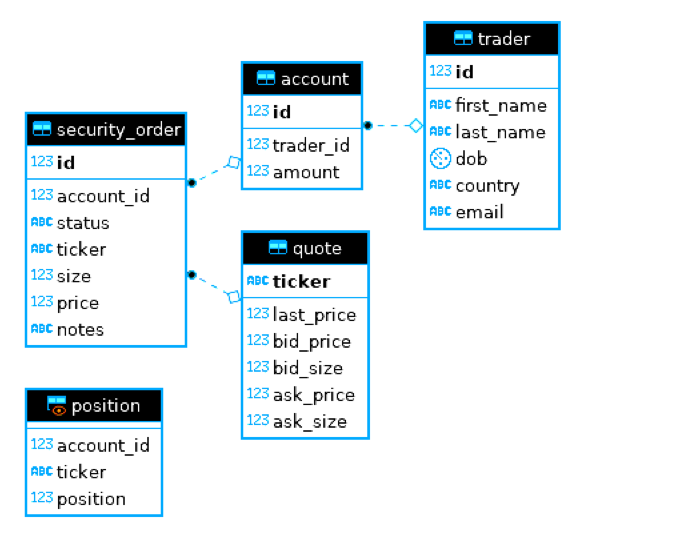

# Introduction
## Overview
The purpose of this repository is as follows:
1) Demonstrate how to dockerize a Java Springboot Micro-service Application using Docker for local development environment.  
2) Deploy the Application in AWS Elastic BeanStalk as a Dockerized container using the Elastic Beanstalk deployment service (combination of EC2, RDS, S3).
## Application
You can find the Trading Application that will be deployed at https://github.com/zhenzhangca/Trading_Application.git    
It is a trading platform simulation that allows traders to trade securities. By building REST APIs using Springboot, this application can implement the following functions:
- Manage trader information and accounts.
- Execute security orders (e.g. buy/sell stocks).
- Process data in batch and real-time.   
	
**Architecture diagram**  
	


# Dockerize trading_app
## Clone project
Clone the Trading_Application project from GitHub using command `git clone https://github.com/zhenzhangca/Trading_Application.git`.
## Commands
```
#start docker
sudo systemctl start docker
#17.05 or higher
sudo docker -v

#create network bridge between SpringBoot app and postgreSQL
sudo docker network create --driver bridge trading-net

#build trading-app image
cd Trading_Application/
sudo docker build -t trading-app .

#build jrvs-psql image
cd psql/
sudo docker build -t jrvs-psql .

#run a jrvs-psql container, attach this container to trading-net network
sudo docker run --rm --name jrvs-psql \
-e POSTGRES_PASSWORD=password \
-e POSTGRES_DB=jrvstrading \
-e POSTGRES_USER=postgres \
--network trading-net \
-d -p 5432:5432 jrvs-psql

#Setup IEX token
IEX_TOKEN='my_IEX_token'
#run a trading-app container
sudo docker run \
-e "PSQL_URL=jdbc:postgresql://jrvs-psql:5432/jrvstrading" \
-e "PSQL_USER=postgres" \
-e "PSQL_PASSWORD=password" \
-e "IEX_PUB_TOKEN=${IEX_TOKEN}" \
--network trading-net \
-p 8080:8080 -t trading-app

#list all the running container
docker container ls

#verify health
curl localhost:8080/health

#verify Swagger UI from the browser
localhost:8080/swagger-ui.html
```
## Swagger-UI page


## Docker Architecture Diagram


## Dockerfiles

  - Create a Dockerfile in the root directory of Trading_Application   
    
   
  `Build stage` commands:
   1) Pull the maven image from Dockerhub, then launch a container (rename it as build) before running the app.  
   2) Copy `src` to `/build/src`.  
   3) Copy `pom.xml` to `/build/`.  
   4) Run `mvn -f /build/pom.xml clean package -DskipTests` to generate artifacts(jar files). 
   Because we just need this container to compile and package the app rather than running it, we will not need it after the artifacts are generated.  
  
  `Package stage` commands:
   1) Pull the open JDK image from Dockerhub, then launch a container.   
   2) Copy jar file to the location of container.    
   3) Run the app.    
   
    
  - Create a Dockerfile in the `psql` directory   
    
  1) Database  
  In the commands above, we set up the value of environment variables `POSTGRES_PASSWORD`, `POSTGRES_DB` and `POSTGRES_USER`. Then, a database with the name of `POSTGRES_DB` will be created when the postgres image is first started.  
  2) Tables  
  In the Dockerfile, command `FROM postgres` means regarding the postgres image from Dockerhub as a basic image, command `COPY ./sql_ddl/schema.sql /docker-entrypoint-initdb.d/` means copy `schema.sql` file from localhost to the postgres container.  
  After the entrypoint calls initdb to create the default postgres user and database, it will run `schema.sql` file automatically to create following tables: 
   
**ER diagram**  

     
   
# Cloud Architecture Diagram


The diagram includes the following components:
- trading-app-alb: Application Load Balancer listens on port 80
- trading-app-alb-sg: Security Group of Load Balancer opens port 80 to Internet Gateway anywhere
- trading-app-server: EC2 instance with docker engine and trading-app container running 
- trading-app-server-sg: Security Group of EC2 instances opens port 8080
- trading-app-asg: Auto-scaling Group of EC2 instances
- trading-app-rds: RDS instance for database management
- trading-app-rds-sg: Security Group of RDS opens port 5432

Application Load Balancer can load balance the traffic to make the trading app more robust, if any EC2 instance is down(unhealthy), the Load Balancer will not forward traffic to that node, but 2 backups are still healthy to make the app up and running regularly.   
Auto-scaling Group is a way to automatically scale up or down the number of EC2 instance that are being allocated to the application based on its needs at any given time.

  
# AWS EB and Jenkins CI/CD Pipeline Diagram  

In this part, I use Jenkins to build a pipeline which deploys the latest trading app source code from GitHub to AWS EB environments (both dev and prod environment). Specifically, the pipeline is able to execute the following steps automatically:  
1. Download the latest source code from GitHub
2. Compile and package source code
3. Deploy to dev or prod environment using EB CLI